

# **תכנות בסביבת האינטרנט**
## ***העמוד הראשי:***
##### תצלום מסך:
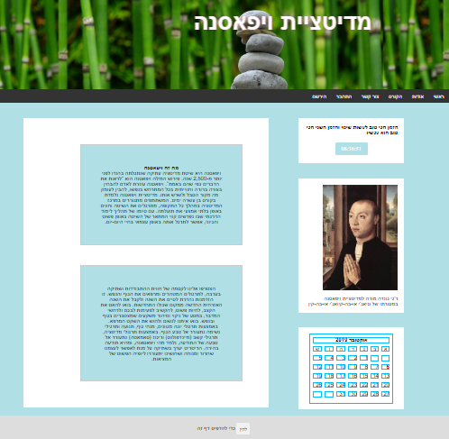
##### הסבר הדף:
בעמוד הראשי יש הסבר קצר על תהליך הוויפאסנה תמונתו של המנטור רג'י  ושעון ולוח שנה עדכניים.

## ***אודות:***
##### תצלום מסך:
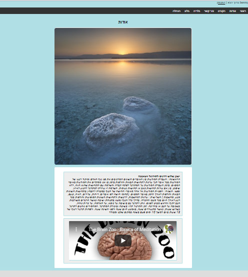
##### הסבר הדף:
בעמוד זה ישנם שלושה תמונות המחלפות זה אחר זה והסבר מעמיק יותר על מהותה של הוויפאסנה וסרטון המסביר יותר לעומק מהי 
ויפאסנה.

## ***הקורס:***
##### תצלום מסך:
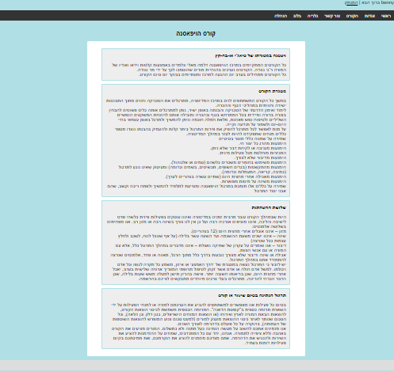
##### הסבר הדף:
בעמוד זה אנחנו יש הסבר מעמיק על קורס הוויפאסנה והסבר על אופן התשלום.

## ***צור קשר:***
##### תצלום מסך:
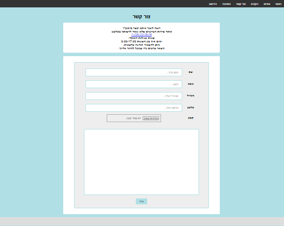
##### הסבר הדף:
בדף צור הקשר ישנה אפשרות ללקוח מתעניין להשאיר את הפרטיו האישיים, לכתוב הודעה ולצרף קובץ. ברגע שהלקוח המתעניין לוחץ על כפתור שלח, הנתונים שכתב נשלחים ישירות לתיבת המייל של רג'י.

## ***התחברות:***
##### תצלום מסך:
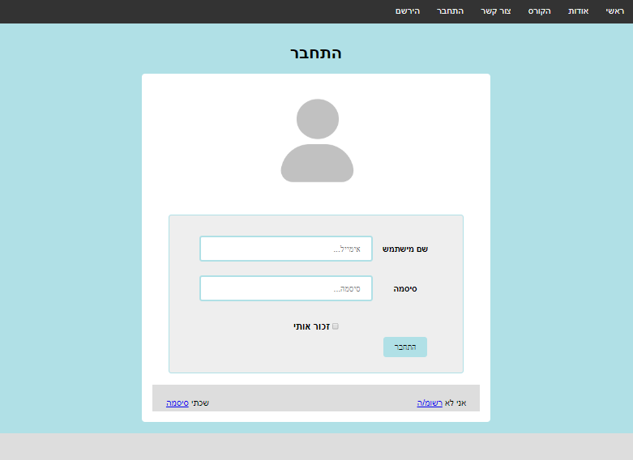
##### הסבר הדף:
בעמוד זה המשתמש מתחבר לאתר על ידי המייל והסיסמא שאיתם נרשם. ברגע שהמשתמש לוחץ על תיבת "זכור אותי" בעתיד כאשר יתחבר, שם המשתמש שלו והסיסמה יהיו כתובים באופן אוטומטי, ללא צורך בהקלדתו.

## ***שכחתי סיסמה:***
##### תצלום מסך:
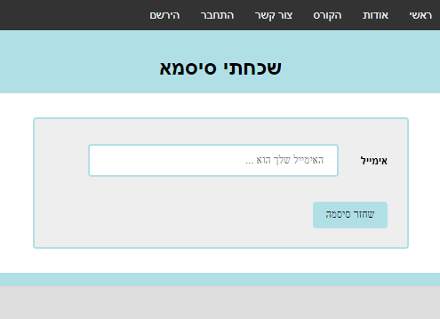
##### הסבר הדף:
בדף זה משתמש שאינו מחובר יוכל לשחזר את הסיסמה שלו במידה וכתובת האימיל שלו אומתה בעבר.

## ***התנתקות:***
##### תצלום מסך:
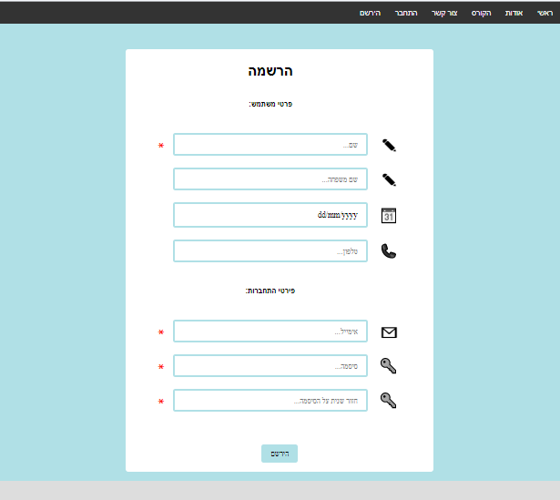
##### הסבר הדף:
דף זה מאפשר למשתמש מחובר להתנתק.

## ***הרשמה:***
##### תצלום מסך:

##### הסבר הדף:
התהליך הראשוני של משתמש באתר הוא להירשם. הוא מכניס פרטים שאיתם יזדהה כאשר יתחבר בעתיד.

## ***גלריה:***
##### תצלום מסך:
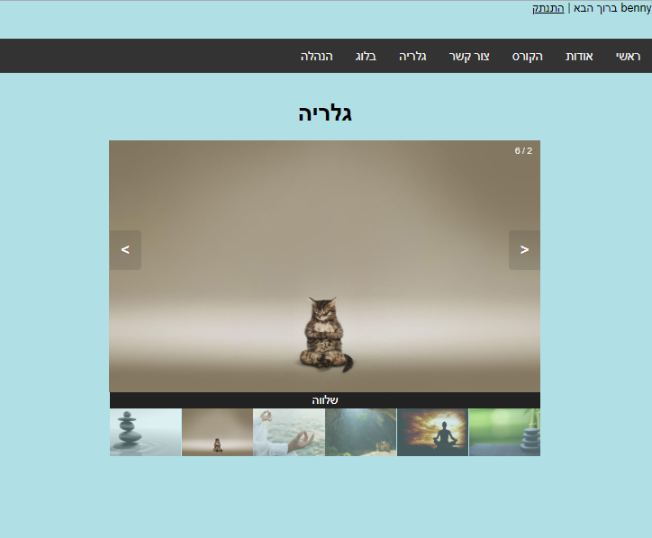
##### הסבר הדף:
בעמוד זה יוצגו גלרית תמונות שאותן רג'י צילם. רק למשתמשים מחוברים.

## ***בלוג:***
##### תצלום מסך:
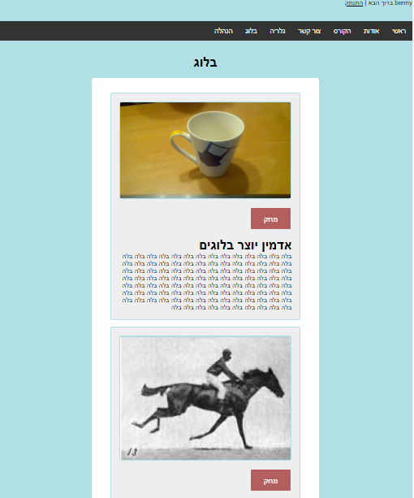
##### הסבר הדף:
עמוד זה מציג את הבלוגים שרג'י כותב ומעלה רק למשתמשים מחוברים.
כאשר רג'י מתחבר וניכנס לעמוד, העמוד מציג אך ורק לו את האופציה למחוק בלוג.

## ***הנהלה:***
##### תצלום מסך:
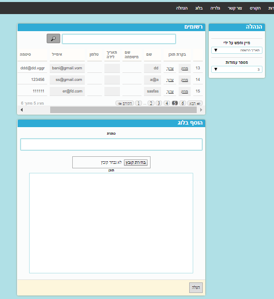
##### הסבר הדף:
בעמוד זה יכול האדמין להתבונן בטבלת המשתמשים הרשומים. כמו כן הוא יכול למיין את הטבלה, לחפש ערך מסוים לפי: שם, שם משפחה, כתובת אימייל, תאריך לידה ותאריך הרשמה. הוא גם יכול להחליט האם הוא רוצה תצוגה של 3 / 5 / 10 שורות.
האדמין יכול לדפדף בין חלקח הטבלה השונים בעזרת כפתורי הניווט. בנוסף, בעמוד ההנהלה האדמין יכול לפרסם בלוג חדש, בעל תמונה, כותרת ותוכן.

## ***ערוך:***
##### תצלום מסך:
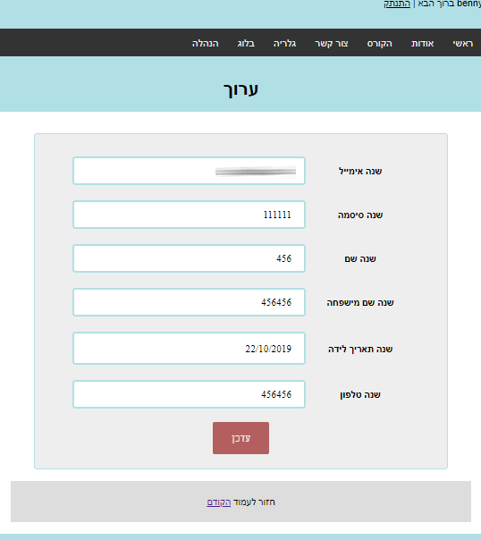
##### הסבר הדף:
בעמוד זה האדמין יוכל לערוך פרטים של משתמשים רשומים.

## ***אימות כתובת מייל:***
##### תצלום מסך:
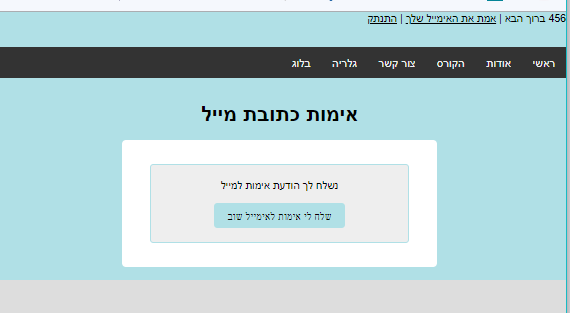 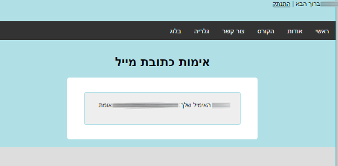
##### הסבר הדף:
בדף זה משתמש רשום יוכל לאמת את כתובת האיימיל שלו.

# **קשרים וישויות**
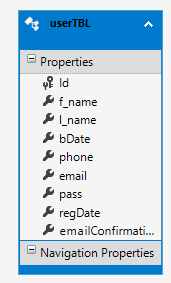 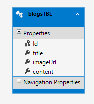

# **פרטי האדמין:**
שם משתמש : admin@gmail.com
סיסמה : 123456 

